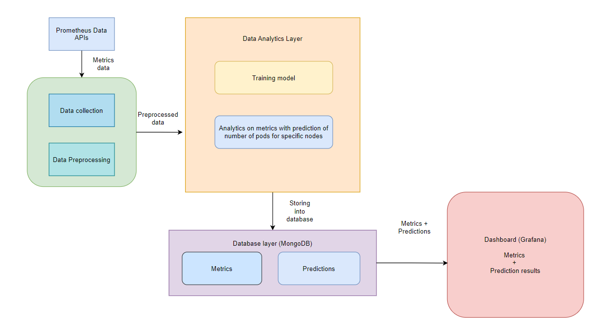

# Software Architecture I2 Project: Energy efficiency for Kubernetes clusters
<small>AvengHERs</small>

## Introduction
With the increasing adoption of microservice architecture, orchestration systems like Kubernetes are increasingly being used. These orchestration platforms work on handling resource allocation, workload distribution, scaling, and deployment of containerized applications. With this, such systems have a major role in managing the carbon footprint of the application. 

## Objective
The objective of our system is to collect, analyze and present the resource utilization and energy consumption of individual APIs running in a Kubernetes cluster. Our system collects the usage metrics of Kubernetes pods using the existing Prometheus APIs and visualizes the resource usage for robust monitoring. The monitoring capability offered by the system is important to ensure efficient utilization of resources and to identify possible issues or bottlenecks. Monitoring also provides insights into the usage patterns of the pods from historical data and enables effective resource allocation based on anticipated scaling needs.

## Architecture
Our system follows a pipeline architecture with a sequence of components performing different processing steps. The different components or sub-systems in our pipeline are as follows:
1.	Data processing component: This component handles the data collection and preprocessing. The data is collected using Prometheus Data APIs and then cleaned and preprocessed to be used for analysis.
2.	Data analytics component: This component performs the analysis on the data to derive the CO2 consumption of the Kubernetes pods. It will also have a training sub-component where a machine learning model will be trained to perform predictive analysis to provide intelligent decision-making capabilities for future resource allocation.
3.	Data storage component: This component makes use of a MongoDB database to store the collected metrics and data analysis results.
4.	Data Visualization component: This component features a dashboard that visualizes the resource usage of the Kubernetes pods in the cluster and displays the results from the data analysis component.
 

## Architecture Type
Since the system requires a sequence of different processing steps, we felt that the pipeline architecture pattern would be the best fit. Using a pipeline architecture, we get advantages such as:
* Separation of concern: The pipeline architecture allows for different components, each of which performs a specific task. This provides a clear separation of responsibilities and modularity.
* Reusability: Each component of the pipeline can be reused in other pipelines or scenarios.
* Flexibility: Changes to one component do not affect the other components. This enables flexibility and provides ease of maintenance. 

## Requirements
The requirements of the project were to have a dashboard that:
* presents the CPU, RAM, and pod utilization of the Kubernetes cluster.
* provides information on the energy efficiency of the cluster in terms of CO2 consumption, and
* provides useful information on optimizing the use of cluster resources.

Our system achieves these requirements by having:
* a dashboard that provides monitoring of the cluster resources.
* an analytics component that computes the CO2 consumption based on resource utilization.
* a predictive model that aids in decision-making for optimizing resource usage of the cluster.

# Grafana Dashboard for Kubernetes Cluster RAM and CPU Utilization

#### The memory and CPU usage in the percentage of all nodes(table in the right showing the list of all nodes) in the cluster:

#### The memory usage in a cluster grouped by Kubernetes namespace, deployment, and pod:

#### The CPU usage in a cluster grouped by Kubernetes namespace, deployment, and pod:

